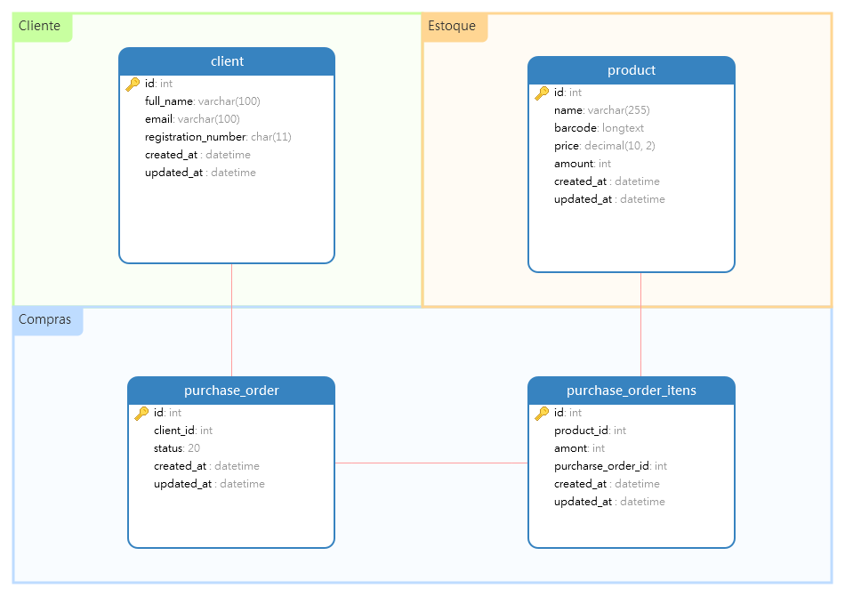

# Teste para Desenvolvedor PHP | Nível Junior

Olá, Dev.  Abaixo estaremos descrevendo um teste á ser realizado, queremos analisar suas habilidades de desenvolvimento, coding e resolução de problemas. 

Leia com atenção as instruções e qualquer duvida não exite em perguntar, sempre será melhor sanar uma dúvida, seja ela qualquer, do que codar uma regra de negócio que você não tem certeza que está certa. 

## Instruções e funcionalidades

O desafio consiste em implementar uma aplicação Web utilizando um framework PHP e um banco de dados relacional, a partir de uma modelagem de dados inicial.

Você vai criar uma aplicação para uma ordem de compra, onde cada ordem de compra possui um cliente e uma lista de produtos associada a ela. Na aplicação deve ser possível alterar a quantidade de unidades de um produto e modificar o status da ordem de compra.

Listando temos:
- CRUD de clientes.
- CRUD de produtos.
- CRUD de pedidos de compra.
  - O status do pedido pode ser alterado para: Em Aberto, Pago ou Cancelado.
- Cada CRUD:
  - Deve ser filtrável e ordenável por qualquer campo, e possuir paginação de 20 itens.
  - Deve possuir formulários para criação e atualização de seus itens.
  - Deve permitir a deleção de qualquer item de sua lista.
- Barra de navegação entre os CRUDs.
- Links para os outros CRUDs nas listagens (Ex: link para o detalhe do cliente da compra na lista de pedidos de compra).

## Modelo de dados

A modelagem inicial para a implementação solução é a seguinte:

Você pode alterar esta modelagem para o teste, será analizada o motivo das mudanças e implementação das modificações.

Além disso, a implementação deste modelo em um banco de dados relacional deve ser realizada levando em consideração os seguintes requisitos:

- O banco de dados deve ser criado utilizando Migrations do framework, e também utilizar Seeds e Factorys para popular as informações no banco de dados.
- Implementação das validações necessárias na camada que julgar melhor. 

## Tecnologias e ferramentas

Abaixo a lista de tecnologias e ferramentas a serem utilizadas para a construção da aplicação.

- Framework
  - Laravel:6 ou Yii2
- Frontend
    - HTML5
    - CSS3
    - Javascript
    - Bootstrap:4 (não obrigatório)
- Backend
  - PHP:7.3
- Database
  - Postgres:11 ou Mysql:8  

## Entrega

Para iniciar o teste, faça um fork deste repositório, crie uma branch com o seu nome completo e depois envie-nos o pull request. Se você apenas clonar o repositório não vai conseguir fazer push e depois vai ser mais complicado fazer o pull request.

## Bônus

- Implementar autenticação de usuário na aplicação.
- Permitir que o usuário mude o número de itens por página.
- Permitir deleção em massa de itens nos CRUDs.
- Implementar a camada de Front-End utilizando a biblioteca javascript Bootstrap e ser responsiva.
- API Rest JSON para todos os CRUDS listados acima.
- Uso de Docker para provisionar o projeto

## Dicas para um bom desenvolvimento

- [PHP: The Right Way](http://br.phptherightway.com)
- [Clean Code PHP](https://github.com/jupeter/clean-code-php)
- [Clean Code: Boas práticas para escrever códigos impecáveis!](https://medium.com/joaorobertopb/2-clean-code-boas-pr%C3%A1ticas-para-escrever-c%C3%B3digos-impec%C3%A1veis-361997b3c8b5)
- [PHP Standard Recommendations](https://www.php-fig.org/)

# Boa sorte, Dev!!!
